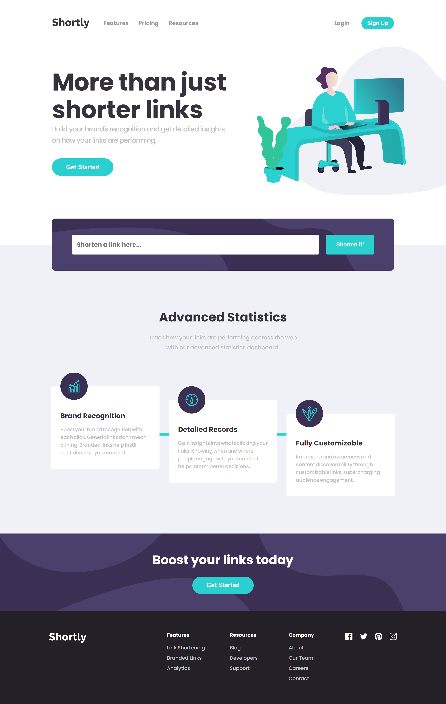

# Frontend Mentor - Shortly URL shortening API Challenge solution

This is a solution to the [Shortly URL shortening API Challenge challenge on Frontend Mentor](https://www.frontendmentor.io/challenges/url-shortening-api-landing-page-2ce3ob-G). Frontend Mentor challenges help you improve your coding skills by building realistic projects.

## Table of contents

- [Overview](#overview)
  - [The challenge](#the-challenge)
  - [Screenshot](#screenshot)
  - [Links](#links)
- [My process](#my-process)
  - [Built with](#built-with)
  - [What I learned](#what-i-learned)
- [Author](#author)

## Overview

### The challenge

Users should be able to:

- View the optimal layout for the site depending on their device's screen size
- Shorten any valid URL
- See a list of their shortened links, even after refreshing the browser
- Copy the shortened link to their clipboard in a single click
- Receive an error message when the `form` is submitted if:
  - The `input` field is empty

### Screenshot



### Links

- Solution URL: [Front End Mentor](https://www.frontendmentor.io/solutions/url-shortening-api-landing-page-using-react-axios-styledcomponents-z6Gk7fQQhf)
- Live Site URL: [Vercel](https://fem-url-shortening-api-landing-page-elbhiruni.vercel.app/)

## My process

### Built with

- Flexbox
- Mobile-first workflow
- [React](https://reactjs.org/) - JS library
- [Create React App](https://create-react-app.dev/) - Setup
- [Axios](https://axios-http.com/) - HTTP Client
- [Styled Components](https://styled-components.com/) - For styles

### What I learned

```js
// react with jsx
const root = ReactDOM.createRoot(document.getElementById("root"));
root.render(<h1>Hello, world!</h1>);
```

```js
// axios with async/await
async function getData() {
  try {
    const response = await axios.get("url");
    console.log(response);
  } catch (error) {
    console.error(error);
  }
}
```

```js
// styled-components
const Button = styled.button`
  background-color: hsl(180, 66%, 49%);
`;
```

## Author

- Website - [El Bhiruni](https://github.com/elbhiruni)
- Frontend Mentor - [@elbhiruni](https://www.frontendmentor.io/profile/elbhiruni)
